# AudioStreamer v0.4

AudioStreamer captures the Windows default playback mix with WASAPI loopback and sends the captured float32 PCM to one Android receiver over a local Wi-Fi network. The Android application parses AudioStreamer protocol v2 packets and plays them through `AudioTrack`.

This is a local-network release for learning and listening tests. UDP delivery is best effort: packet loss or Wi-Fi congestion can cause audible gaps. There is no discovery, retransmission, compression, encryption, internet relay, or multi-receiver selection.

## Architecture

```mermaid
flowchart LR
  Apps[Windows applications] --> Mix[Windows Audio Engine]
  Mix --> Capture[WASAPI loopback capture]
  Capture --> Server[Python desktop server]
  Server -->|float32 PCM in protocol v2 / UDP| Receiver[Android UDP receiver]
  Receiver --> Parser[Packet parser]
  Parser --> Queue[Bounded playback queue]
  Queue --> Track[AudioTrack]
  Track --> Speaker[Phone speaker]
```



The server uses the Windows endpoint's mix format. The Android receiver currently supports stereo `FLOAT32_LE` audio and listens on UDP port `5005` by default. Protocol layout and validation rules are documented in [docs/PROTOCOL.md](docs/PROTOCOL.md).

## Requirements

### Windows server

- 64-bit Windows.
- Python 3.13. The Python launcher (`py`) is recommended; Tkinter must be included with the Python installation.
- Internet access for the first launcher run to install the pinned PyAudioWPatch dependency.
- Windows playback audio routed through the default output device.

### Android receiver

- Android device with Android 7.0 (API 24) or newer.
- Android Studio only if building from source; otherwise install the supplied debug APK.
- The phone and PC must be on the same Wi-Fi/LAN. Guest networks and access-point client isolation can prevent devices from communicating.

## Installation

### Windows server

1. Install Python 3.13 for Windows. Include the Python launcher or add Python to `PATH`.
2. Start `AudioStreamer.bat` from the project folder. On first run it creates `.venv` and installs `requirements.txt`; this may take a few minutes.
3. If Windows Defender Firewall prompts, allow AudioStreamer on private networks.

The launcher checks for Python 3.13 and the expected PyAudioWPatch version. Configuration and logs are stored in the project folder.

### Android APK

The debug APK is produced by the Android Gradle build at:

`client/app/build/outputs/apk/debug/app-debug.apk`

To build it from source, open the `client/` folder in Android Studio and run the `app` debug build, or run `:app:assembleDebug` from the Gradle wrapper in `client/`. Copy the APK to the phone and open it. Android will ask you to permit installing apps from that file source if it is not already allowed; approve that prompt, then complete installation. The debug APK is suitable for evaluation, not a signed public-store release.

## Configuration

The server automatically creates and reads [`config/config.toml`](config/config.toml). Edit it before starting the server:

```toml
receiver_ip = "192.168.1.25"
receiver_port = 5005
protocol_version = 2
capture_queue_chunks = 8
frames_per_buffer = 480
log_level = "INFO"
```

Use the phone's IPv4 address on the local Wi-Fi network for `receiver_ip`. The server GUI also lets you set the destination IP and port and saves the values. The Android app listens on port `5005`; if the server port is changed, its receiver must be changed to match.

`protocol_version` defaults to v2. The server retains v1 transmit compatibility, but v2 is the release configuration and Android parser supports both versions. Do not change packet definitions to configure audio. The capture sample rate and channel count are derived from the Windows output device mix format; a different rate would require resampling, which this release does not add.

The capture queue and `frames_per_buffer` trade latency against scheduling margin. Smaller values may reduce buffering but can increase drops on a busy PC. Start with defaults, then tune one value at a time while watching the server log and Android diagnostics.

## Running the system

1. Connect the Android phone and Windows PC to the same Wi-Fi network.
2. Install and open **AudioStreamer Receiver** on Android.
3. Tap **Start Receiver**. The app should show that it is waiting for the server.
4. On Windows, run `AudioStreamer.bat`, enter the phone's IPv4 address, and select **Start Streaming**.
5. Play audio on the PC. The receiver should show the incoming sample rate, channels, packet counts, drops, and playback queue.
6. Stop streaming in the desktop window, then stop the receiver in Android.

The receiver must be started first because UDP has no connection handshake. A server-side packet-sent count means the local operating system accepted the datagram for sending; it does not prove that the phone received or played it.

## Diagnostics and logs

The desktop GUI reports stream state, destination, packets sent, and errors. The rotating server log is written to `logs/audiostreamer.log`. The Android screen reports listener/connection status, sample rate, channel count, received and dropped packets, invalid packets, playback queue, and playback status. Keep the Android application in the foreground during playback.

## Troubleshooting

| Symptom | Checks |
| --- | --- |
| Receiver stays at “Waiting for server...” | Start the Windows stream; verify the phone IP and UDP port; confirm both devices are on the same non-isolated LAN. |
| Server sends packets, but Android receives none | Check Windows Defender Firewall for private-network access, router client isolation, VPNs, and the configured phone IPv4 address. UDP has no acknowledgement, so the sender cannot confirm phone delivery. |
| “Invalid packet” appears | Confirm the server is using protocol v2 and the Android app is the matching AudioStreamer receiver. Inspect `logs/audiostreamer.log` for server errors. |
| Packets arrive, but there is no audible output | Raise phone media volume; verify the PC is playing through the default Windows output; check the displayed sample rate and channel count; stop and restart both sides. |
| Audio gaps or dropped packets increase | Try the defaults first; reduce other Wi-Fi traffic; keep devices near the access point. A smaller capture buffer may reduce latency but can make scheduling drops more likely. |
| The launcher reports Python/dependency errors | Install Python 3.13 with the launcher and Tkinter, ensure internet is available for first setup, and check `logs/audiostreamer.log` if present. |

## Project structure

```text
AudioStreamer/
├── AudioStreamer.bat             # Windows launcher and virtual-environment setup
├── main.py                       # Desktop application entry point
├── config/
│   └── config.toml               # User-editable server settings
├── server/
│   ├── audio/capture.py          # WASAPI loopback capture
│   ├── config.py                # Configuration loading and validation
│   ├── gui.py                   # Start/stop desktop interface
│   ├── main.py                  # Server lifecycle orchestration
│   └── network/                 # Protocol v2 and UDP sender
├── client/                       # Android Studio / Gradle project
│   └── app/src/main/java/com/audiostreamer/receiver/
│       ├── audio/AudioPlayer.kt
│       ├── network/              # UDP receiver and protocol parser
│       └── MainActivity.kt
├── docs/PROTOCOL.md              # Wire format specification
├── logs/                         # Runtime logs
└── requirements.txt              # Python server dependency
```

## Roadmap

- Complete a release-device smoke test for capture, UDP delivery, Android playback, and shutdown.
- Produce a signed Android release APK once a release signing key and distribution channel are chosen.
- Continue latency and stability measurements on representative Windows devices and Wi-Fi networks.
- Later project stages may investigate additional receivers and the separate ESP32 control path described by the project plan. They are not part of v0.4.

## Release notes and limitations

- The v0.4 wire format is unchanged. Python keeps protocol compatibility code; Android parses v1 and v2, while the server defaults to v2.
- One destination is configured at a time. The Android receiver uses the configured fixed listening port.
- There is no receiver discovery or delivery acknowledgement.
- This repository does not yet declare a software license. Choose and add one before public redistribution.
- The checked-in project builds a debug APK. A public release still needs signing/distribution decisions and an end-to-end test on the target phone and network.
